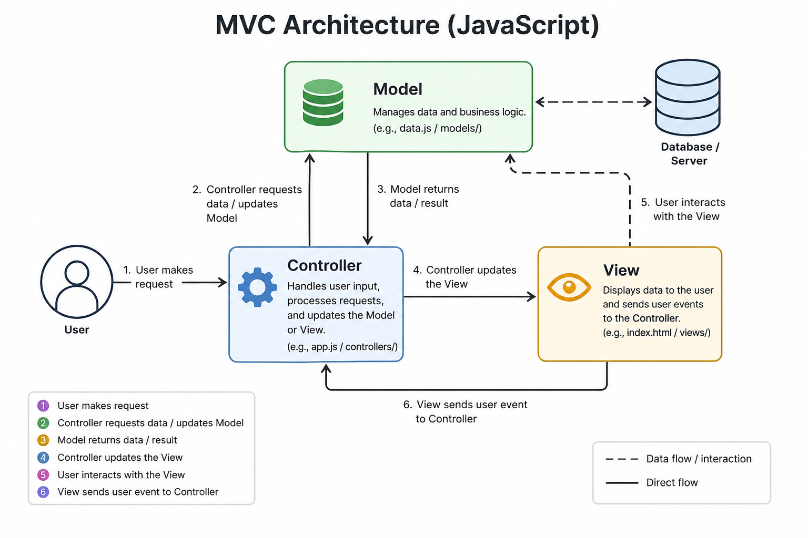

# Gourmetia 🍽️

### A State-Driven Culinary Platform Built with Vanilla JavaScript

Gourmetia is not just another recipe application.

It was built to answer a deeper engineering question:

> **Can a modern, scalable, highly interactive web application be built using only Vanilla JavaScript without relying on frontend frameworks?**

The answer became Gourmetia.

Designed from the ground up as a fully state-driven **Single Page Application (SPA)**, Gourmetia recreates many of the architectural patterns commonly associated with modern frontend ecosystems — but implemented manually using native browser APIs, modular JavaScript, and a custom MVC architecture.

Rather than depending on abstraction-heavy frameworks, Gourmetia focuses on understanding the underlying mechanics of frontend engineering itself:

- State synchronization
- UI orchestration
- Data hydration
- Client-side routing
- Persistent local state
- Scalable architecture
- Performance-oriented rendering

The project emphasizes **software design principles** as much as UI development.

---

# ✨ Why Gourmetia Exists

Most recipe websites suffer from the same fundamental problems:

- Fragmented user experience
- Slow page reloads
- Poor data consistency
- Static interfaces
- Weak personalization
- Limited interaction between local and remote data

Recipes are treated as static HTML content instead of living application state.

Gourmetia approaches the problem differently.

The application treats recipes as dynamic entities that continuously synchronize between:

- external APIs,
- local persistence,
- UI state,
- and user interaction.

This transforms the cooking experience into something fluid, reactive, and application-like rather than page-based.

---

# 🧠 Engineering Philosophy

The project was intentionally built without React or frontend frameworks in order to deeply understand:

- how reactive UIs work internally,
- how state flows through applications,
- how rendering systems communicate with business logic,
- and how scalable frontend architecture is designed from first principles.

Instead of outsourcing complexity to frameworks, Gourmetia embraces it directly.

---

# 🚀 Core Features

## 🔍 Smart Recipe Search

Real-time recipe discovery powered by external APIs with:

- query normalization,
- local bookmark integration,
- deduplication logic,
- and intelligent hydration.

---

## 🧩 Dynamic Data Hydration Engine

Most recipe APIs return incomplete or inconsistent data.

Gourmetia solves this by implementing a custom hydration layer that enriches recipes dynamically with:

- ingredients,
- difficulty estimation,
- cooking time,
- categories,
- country metadata,
- and normalized structures.

This creates a unified internal data model regardless of source inconsistencies.

---

## 📚 Persistent Bookmarking System

Bookmarks are synchronized through:

- centralized application state,
- UI updates,
- and `localStorage` persistence.

The result is a seamless user experience with zero-friction recovery after reloads.

---

## ⚖️ Dynamic Ingredient Scaling

Recipes automatically recalculate ingredient quantities when servings change.

This transforms static recipe instructions into interactive cooking logic.

---

## 🧭 SPA Routing System

The application uses a hash-based router combined with the History API to simulate native app navigation without full page reloads.

This provides:

- smoother transitions,
- faster interactions,
- and a significantly more responsive UX.

---

## 📝 User-Generated Recipes

Users can upload custom recipes through a modal-based workflow powered by Supabase.

Uploaded recipes are:

- normalized,
- integrated into global state,
- and instantly synchronized across the UI.

---

# 🏗 Architecture Overview

Gourmetia follows the **MVC (Model-View-Controller)** architectural pattern.

The project was structured around one primary goal:

> **Strict Separation of Concerns**

Each layer has a clearly defined responsibility.

---

# ⚙️ MVC Architecture

---



---

## 📦 Model Layer

Responsible for:

- global state management,
- API communication,
- Supabase integration,
- data normalization,
- hydration,
- pagination logic,
- and persistence handling.

The model acts as the application's data engine.

---

## 🎨 View Layer

Responsible for:

- rendering UI components,
- handling DOM manipulation,
- and managing user interaction events.

Each UI component is isolated into its own view module:

- Recipe View
- Search View
- Pagination View
- Bookmarks View
- Categories View
- etc.

This modularity significantly improves maintainability and scalability.

---

## 🎮 Controller Layer

Acts as the orchestration engine between views and the model.

Responsibilities include:

- coordinating application flow,
- synchronizing state updates,
- routing,
- and handling async operations.

The controller ensures business logic never leaks into the UI layer.

---

# 🧱 Frontend Architecture Decisions

## Centralized State Management

Instead of scattering data across components, Gourmetia uses a unified global state object.

This enables:

- predictable UI synchronization,
- simplified rendering,
- and cleaner data flow.

---

## Manual Reactive Rendering

UI updates are manually coordinated through targeted DOM updates instead of full re-renders.

This approach improves:

- rendering efficiency,
- performance,
- and architectural clarity.

---

## Modular File Structure

The project structure was designed to scale cleanly as features grow.

The codebase separates:

- components,
- utilities,
- configuration,
- business logic,
- and styling systems.

---

# 🎨 Styling System & UI Engineering

Gourmetia uses a fully modular styling architecture built with **Sass (SCSS)** following a component-oriented structure.

---

## 🧩 SCSS Architecture

The styling system is divided into:

- components,
- utilities,
- global styles,
- and vendor overrides.

This keeps styles:

- reusable,
- scalable,
- and maintainable.

---

## 🎛 Bootstrap Customization

Bootstrap was not used as a plug-and-play framework.

Instead:

- Bootstrap variables were customized,
- core styles were overridden,
- and the framework was integrated into the SCSS compilation pipeline.

This allowed full design control while still benefiting from Bootstrap’s responsive utilities and layout system.

---

## ⭐ Font Awesome Integration

Font Awesome icons were locally compiled and integrated directly into the Sass architecture for:

- performance,
- asset control,
- and consistent styling.

---

## 📱 Fully Responsive Design

The application was designed mobile-first and optimized across:

- mobile devices,
- tablets,
- laptops,
- and large desktop screens.

Responsiveness was implemented using:

- SCSS mixins,
- Bootstrap utilities,
- flexible layouts,
- and adaptive component structures.

---

# ⚡ Performance Considerations

Several engineering decisions were made to improve runtime performance:

- Lazy recipe hydration
- Partial UI updates
- SPA navigation
- Deduplicated search merging
- Reduced unnecessary API requests
- Centralized state synchronization

---

# 🛠 Tech Stack

| Technology                | Purpose                      |
| ------------------------- | ---------------------------- |
| Vanilla JavaScript (ES6+) | Core application logic       |
| MVC Architecture          | Application structure        |
| Parcel                    | Bundling & optimized builds  |
| Sass (SCSS)               | Modular styling system       |
| Bootstrap                 | Responsive layout foundation |
| Font Awesome              | Icon system                  |
| Supabase                  | Backend persistence          |
| LocalStorage              | Client-side persistence      |

---

# 📂 Project Structure

```text
.
├── index.html
├── package.json
├── package-lock.json
├── postcss.config.js
├── robots.txt
└── src
    ├── assets
    │   └── imgs
    │       ├── fav-icon.png
    │       ├── hero-img.jpg
    │       ├── pizza.png
    │       └── tacos.png
    ├── js
    │   ├── bootstrap.bundle.min.js
    │   ├── config.js
    │   ├── controller.js
    │   ├── helpers.js
    │   ├── icons.js
    │   ├── model.js
    │   ├── supabase.js
    │   └── views
    │       ├── addRecipeView.js
    │       ├── bookmarksView.js
    │       ├── categoryView.js
    │       ├── footerCategoryView.js
    │       ├── homeView.js
    │       ├── navView.js
    │       ├── paginationView.js
    │       ├── recipeView.js
    │       ├── resultsView.js
    │       ├── searchBarView.js
    │       ├── searchView.js
    │       └── view.js
    ├── sass
    │   ├── components
    │   │   ├── _add-recipe.scss
    │   │   ├── _bookmarks.scss
    │   │   ├── _footer.scss
    │   │   ├── _header.scss
    │   │   ├── _hero.scss
    │   │   ├── _index.scss
    │   │   ├── _loader.scss
    │   │   ├── _logo.scss
    │   │   ├── _nav.scss
    │   │   ├── _recipe-load__icon.scss
    │   │   ├── _recipe-load.scss
    │   │   ├── _recipes.scss
    │   │   └── _searchbar-popup.scss
    │   ├── global
    │   │   ├── _base.scss
    │   │   ├── _colors.scss
    │   │   ├── _index.scss
    │   │   └── _typography.scss
    │   ├── main.scss
    │   ├── util
    │   │   ├── _functions.scss
    │   │   ├── _index.scss
    │   │   └── _mixins.scss
    │   └── vendors
    │       ├── _bootstrap.scss
    │       ├── _fontawesome.scss
    │       └── _index.scss
    └── webfonts
        ├── fa-brands-400.woff2
        ├── fa-regular-400.woff2
        ├── fa-solid-900.woff2
        └── fa-v4compatibility.woff2

12 directories, 56 files
```

---

# 🧪 What This Project Demonstrates

This project demonstrates practical understanding of:

- Application architecture
- State management
- SPA design patterns
- API integration
- Data normalization
- UI orchestration
- Responsive frontend engineering
- Scalable code organization
- Asynchronous JavaScript
- Modular CSS architecture
- Client-side persistence

---

# ⚙️ Installation

## Clone the repository

```bash
git clone https://github.com/AmirAhmedShaaban/gourmetia-recipe-app.git
```

---

## Install dependencies

```bash
npm install
```

---

## Start development server

```bash
npm start
```

---

## Create production build

```bash
npm run build
```

---

# 💡 Author

## Amir Shaaban

Frontend Developer focused on:

- scalable frontend architecture,
- modern JavaScript engineering,
- and deeply understanding how frontend systems work under the hood.
